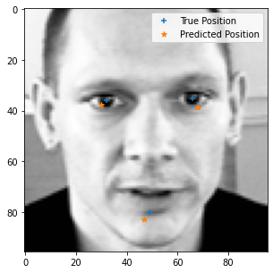
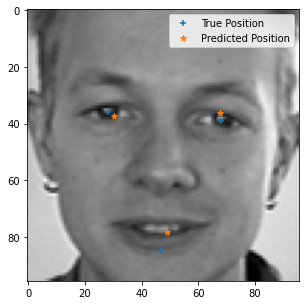
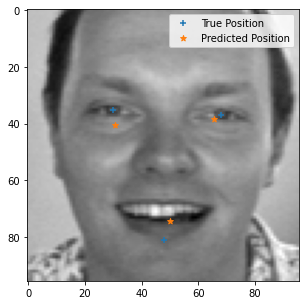
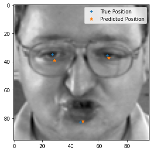

# Facial Keypoint Detector 

This deep learning model based on convolutional neural networks detects left eye , right eye and mouth from a image of a face.

The model has 7 Convolutional layers and 3 Linear layers.
Implemented with Pytorch.
Used Tensorboard for learning visualisation.

Measure -  MSELoss
Optimiser -  Adagrad 

Trained Using dataset from Kaggle
https://www.kaggle.com/c/facial-keypoints-detection/data 

Sample images provide model predictions versus  the true values.

            | 
:-------------------------:|:-------------------------:
  | 

Future Possible Work
1.Augmented train dataset with manual labelling of keypoints
2.Using advanced layers such as skip and residual nets.
